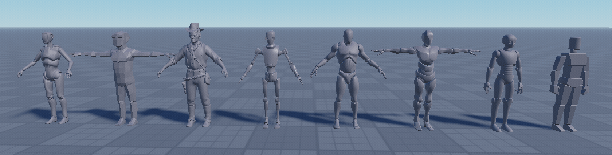
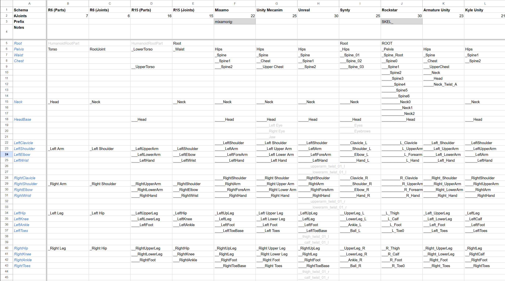

# Standard Skeletons

This repo contains a set of standard skeletons used across DCC for reference.



**Skeletons Available:**
```
 ☐ HumanIK (HIK) (Autodesk) @high
 ✓ YBot - Mixamo (Adobe)
 ✓ Mannequin - Unreal Engine (UE4)
 ✓ Mannequin - Unreal Engine(UE5)
 ✓ Armature - Unity Humanoid Rig
 ✓ KyleRobot - Unity
 ☐ BVH - (Biovision Hierarchy) (CMU Mocap)
 ☐ Rigify (Blender)
 ✓ MetaHuman Skeleton - Unreal
 ✓ Manny - R15 (Roblox)
 ✓ MrCrash - R15 (Roblox)
 ☐ Valve Biped @high
 ☐ DAZ Genesis Skeletons
 ✓ ArthurMorgan - Red Dead (Rockstar)
 ✓ Autosetup Hierarchy
 ✓ Character - Synty Assets Skeleton
 ✘ Unity mocap online
 ✓ SMPL
 ☐ TLOU
```
✓ = available
☐ = TODO


---
[This Google Sheet](https://docs.google.com/spreadsheets/d/1TWTtSdNhozVys23JobgAPSFMcAIOkfyOq2gf3ofywbs/edit?usp=sharing) has an in-depth comparison of different standard skeletons.
